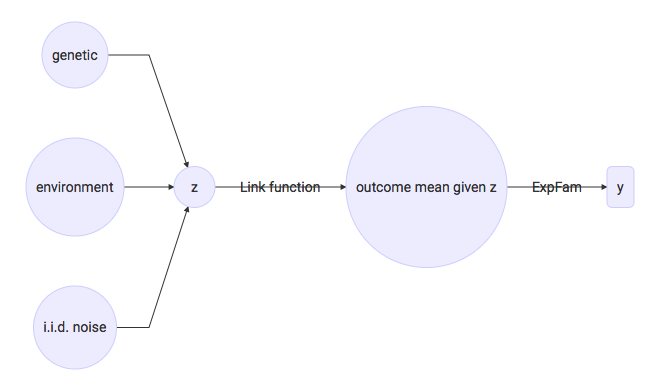

# Generalised linear mixed models for genetic analysis

$$
% Shortcuts
\newcommand{\mcal}{\mathcal}
\newcommand{\eps}{\epsilon}
\newcommand{\eita}{\boldsymbol\eta}

% Distributions
\newcommand{\normal}[2]{\mathcal{N}\left(\, {#1} \,;\, {#2} \,\right)}
\newcommand\Normal[3]{\normal{ {#1} \, \big| \, {#2} }{ {#3} }}

% Probability
\newcommand{\Pr}[1]{\text{P}\left[ {#1} \right]}

%Indicator
\newcommand{\Ind}[1]{\text{Indicator}\{ {#1} \}}

% Dataset
\newcommand{\data}{\mathcal{D}}

% Outcome nature
\newcommand{\outcome}{\mathcal{O}}

% Transpose
\newcommand{\T}{^\intercal}

% Exponential-family distribution
\newcommand{\expfam}[1]{ \text{ExpFam} ({#1}) }

% KL divergence
\newcommand{\KL}[2]{\text{KL}\left[\, {#1}  \,||\, {#2} \,\right]}

% Derivative
\newcommand{\diff}[2]{\frac{ \mathrm{d} {#1} }{ \mathrm{d} {#2} }}

% Matrix
\newcommand{\mat}{\mathrm}

\newcommand{\bmu}{\boldsymbol\mu}
\newcommand{\balpha}{\boldsymbol\alpha}
\newcommand{\bbeta}{\boldsymbol\beta}
\newcommand{\bepsilon}{\boldsymbol\epsilon}

\newcommand{EP}{\text{EP}}

\normal{1}{2}, \Normal{1}{2}{2}, \data, \outcome, \balpha, \bbeta,\\
\bepsilon, \expfam{1}, \, \Pr{a=0}, \Ind{x>0}
\KL{p(x)}{q(x)}, \mat A, \mcal N, \diff{y}{x}
$$

## Abstract

The development of computationally efficient yet accurate models has received considerable attention in statistical genetics. In particular linear mixed models (LMMs) are now a well established tool and provide powerful control for population structure and relatedness, allow to aggregate across multiple causal variants in gene sets and can be used to leverage phenotype correlations between multiple (related) traits.

However, the vast majority of existing LMM approaches assume that phenotypes are continuous with Gaussian distributed residuals. This assumption is clearly violated in case/control studies but also in the context of a many sequencing-based phenotypes, such as Poisson distributed read count data or traits defined as the Binomial ratio of (typically small) count values. While generalised linear mixed models provide in principle an established solution to this problem, "exact" methods for parameter inference require expensive MCMC simulations and hence are not applicable to large cohorts. Consequently, non-Gaussian observation likelihood are in practice either ignored or one is left with methods that provide crude approximations to estimate the trait on a latent liability scale.

To address this, we here propose a highly effective deterministic algorithm QEP-LMM that enables near-exact marginalising over the latent liability scale within the LMM framework. This model provides quadratic and in some instances even linear run-time complexity in the number of samples, thus enabling the analysis of datasets with tens of thousands of individuals in the context of genome-wide tests. We extensively compared our model with existing state-of-the-art tools (Gaussian LMM, GCTA, LTMLM, MACAU, and LEAP), both in terms of power to detect associations as well as accuracy for heritability estimation, phenotype prediction, and computational performance. Consistently across settings, we find substantial improvements over current approximate methods. Remarkably, we observe that QEP-LMM achieves near-identical performance to exact MCMC approaches for generalised LMMs at a runtime complexity that is comparable to a standard LMM. Finally, we provide empirical results to demonstrate practical utility of QEP-LMM in applications to data from the WTCCC and in the genetic analysis of splicing phenotypes in human LCLs.

## Introduction

We aim to unify commonly performed analysis in the genetic analysis community such as heritability estimation, genome-wide association studies, phenotype prediction in a broad sense (e.g., disease risk prediction), variance decomposition, accounting for population structure and family relatedness, regressing out instrumental noise, and many others, in the sense that heteregenous traits from many different sorts of stochastic nature could be performed in a non-adhoc manner, with little to no human intervention (we are not talking about preprocessing here, which obviously will always require some considerable human intervention). This clearly could be accomplished by general-purpose Monte Carlo sampling methods but at the expense of restricting it to small dataset. Contrarily, we are aiming for at least dozens of thousands individuals and genome-wide scale number of genetic markers which nowadays easily break hunder of millions point.

The above will be accomplished by the following items:

1. Latent variable to model the genetic, environmental, and the covariate parts.
2. Family of distributions for tackling may sorts of trait nature
3. Link function connecting the latent variable to the observed outcome
4. Fast method for integrating out nuisance parameters and to infer the one need for genetic analysis
5. Convergence should be guaranteed without the need of human intervention
6. A model that allows genetic analysis independently of the used outcome distribution
7. It should be able to handle different trait stochastic nature jointly
8. Afterall, the proposed method has to be empirically as accurate as Monte Carlo sampling methods

## Model

The underlying unobserved trait is modelled by the random variable
$$
z = a + b + \epsilon \tag{1}
$$
where $a$ is the fixed-effect component (also known as covariate effects), $b$ is the random-effect component, and $\epsilon$ is the i.i.d. normally-distributed noise. The fixed-effect is defined by a dot-product between a vector of covariates and a vector of fixed-effect sizes:
$$
a = \mathbf a\T \boldsymbol\alpha
$$
The random-effect is also defined by a dot-product but now between a vector of stuff and a vector of random-effect sizes:
$$
b = \mathbf b\T \bbeta, \qquad \bbeta \sim \mathcal N(0, \sigma^2_{\beta})
$$

Finally, the i.i.d. noise $\epsilon$ is normally distributed with variance $\sigma^2_{\epsilon}$. If we assume independence and that $\mat E[\mathbf b_s] = 0$ and $\mat V[\mathbf b_s]=1/\sqrt{n_b}$ for every $s$, we have $\mat V[b] = \sigma^2_{\beta}$ denoting the overall effect-size of the random component $b$. If we knew the values of vector $\boldsymbol\alpha$  and made analogous assumptions about the covariates, we would have $\mat V[a]  = \sum_{j=1}^{n_a} \boldsymbol \alpha_j^2$. It is under this underlying trait we define genetic concepts such as narrow-sense heritability
$$
h^2=\frac{\sigma^2_{\beta}}{\sigma_t^2}, \qquad \sigma_t^2 = \sum_{j=1}^{n_a} \boldsymbol \alpha_j^2 + \sigma^2_{\beta} + \sigma^2_{\epsilon}
$$

or additive effect-size $\balpha_j$ of a genetic variant $\mathbf a_j$.

In practice however we observe traits that clearly do not follow a Normal distribution, and thus directly applying Eq. (1) might lead to spurious assocation identification or other sort of analysis errors. Thus it is often the case that the phenotype is first transformed (e.g. Box-Cox transformation, quantile normalization) to resemble a normally distributed trait. However, there are many cases in which the proper distribution is know or where there does not seem to exist such a transformation.

Here we take a different approach. We use the linear equation expressed in Eq. (1) to describe a process we experimentally don't see. This unobserved process though is assumed to be directly associated with the observed one via a link function and its mean definition:
$$
g(\mat E[y|z]) = z
$$
The observed trait is then described via an exponential-family distribution chosen as to match the phenotype random nature.

Fig. 1 shows the corresponding Graphical Model:

</img>

Therefore the user is free to choose the distribution that represent the observed process, as long as it can be completly defined by specifying its mean.

## Exponential-family

The exponential-family distributions for standard GLMMs are defined as
$$
y \sim \exp\{(y\theta - f_b(\theta))/f_a(\phi) + f_c(y, \phi)\}
$$
with two scalar paramaters $\theta$ and $\phi$, the later commonly called dispersion. The variable $y$ is naturally the outcome modelled by a distribution that emerges from the definition of the $f_{\cdot}(\cdot)$ functions and of the two parameters. As an example, the Bernoulli distribution with probability of success $p$ emerges from the above formulae by setting
$$
\theta = \log\left(\frac{p}{1-p}\right), \phi = 1, f_a(\phi) = \phi, f_b(\theta)=\log(1+e^\theta), f_c(y, \phi) = 0
$$
This class of distributions has the following two properties (McCullagh89):
$$
\mat E[y|\theta, \phi] = f'_b(\theta)\\
\mat V[y|\theta, \phi] = f''_b(\theta) f_a(\phi) \tag{1}
$$

and encompass many of the probability distributions used in practice. (We will avoid explicitly conditioning on $\phi$ as it is assumed to be given everywhere.)

## Generalised linear mixed models

It requires first the definition of a twice-differentiable  function $g:\mathcal R \rightarrow \mathcal R$ which will be used to associate  the latent random variable $z$ to the outcome expectation as follows:
$$
g(\mat E[y|\theta]) = z  \tag{2}
$$
The above equation makes clear the connection of $z$ with $\theta$ by also considering Eq. (1). We are now ready to define an instance of the model.

## Instance of the model

Given a dataset $\data = \{\mathbf y \in \mathcal R^n, \mat A \in \mathcal R^{n\times n_a}, \mat B \in \mathcal R^{n\times n_b}\}​$ of $n​$ individuals together with a observed distribution specification $\outcome=\{\outcome\}_1^n​$, where each $\outcome = \{\theta, \phi, f_{a}(\cdot), f_{b}(\cdot), f_{c}(\cdot, \cdot), g(\cdot)\}​$ defines an (potentially distinct) exponential-family distribution and link function, we have $\mathbf z = \mat A\T\balpha + \mat B\T\bbeta + \bepsilon​$  distributed according to
$$
\mathbf z \sim \normal{\mat A\T \balpha}{\sigma^2_{\beta} \mat B\mat B\T + \sigma^2_{\epsilon} \mat I} \tag{3}
$$
Moreover, we have now a connection between the latent space and the observed space
$$
p(y_i | z_i) = \expfam{y_i | \outcome_i, b'(\theta)=g^{-1}(z_i)} \tag{4}
$$
which fully describe the marginal likelihood
$$
p(\mathbf y) = \int \prod_{i=1}^n p(y_i|z_i) \Normal{\mathbf z}{\mat A\T \balpha}{\sigma^2_{\beta} \mat B\mat B\T + \sigma^2_{\epsilon} \mat I} \mat d \mathbf z \tag{5}
$$
used in the maximum likelihood approach for parameter fitting.

## Interpretation

### Bernoulli trait

Let $g(x) = \Phi^{-1}(x)$ be the so-called probit link function and consider the Bernoulli likelihood as a suitable distribution of the outcome. Conditioning on the latent variable $z$, we have
$$
p(y|z) = \left\{\begin{gather}
g^{-1}(z) = \Phi(z) & \text{for } y = 1\\
1-g^{-1}(z) = 1-\Phi(z) & \text{for } y = 0
\end{gather}\right.
$$
Let us define a random variable $\tilde y | z = z + e$ in which $z$ is given and $e$ is standard-Normally distributed random variable such that
$$
\tilde y | z = \left\{\begin{gather}
1 & \text{for } z + e > 0\\
0 & \text{for } z + e \leq 0
\end{gather}\right.
$$
Its p.m.f can thus be written as
$$
p(\tilde y | z) = \left\{\begin{gather}
\Pr{e > -z | z} = \int_{-z}^{+\infty} \Normal{x}{0}{1} \mat d x = \Phi(z)  & \text{for } 1\\
\Pr{e \leq -z | z} = \int_{-\infty}^{-z} \Normal{x}{0}{1} \mat d x = 1-\Phi(z) & \text{for } 0
\end{gather}\right.
$$
which proves that $p(y|z) = p(\tilde y|z)$. More generally, let $g(x)$ be any link function (TODO: I might need to assume symmetry here). The definition
$$
p(\tilde y | z) = \left\{\begin{gather}
\Pr{e > -z | z} = g^{-1}(z)  & \text{for } 1\\
\Pr{e \leq -z | z} = 1-g^{-1}(z) & \text{for } 0
\end{gather}\right.
$$
together with equation $\tilde y | z = z + e$ determines the $e$ distribution via its c.d.f. $g^{-1}(z)$. For example, let $g(\cdot)$ be the so-called logit link function. We have $e$ distributed according to the zero-mean Logistic distribution and variance equal to $\pi^2/3$.

A binary trait representing a disease can be defined as

where $e \sim \normal{0}{\sigma_e^2}$ is the source of i.i.d. noise. (talk that $\sigma_{\epsilon}^2$ cannot be distinguished from $\sigma_e^2$ in the Binary case)

The value of $z$ can now be understood as the genetic risk for a particular disease where $\mathbf b$ is a vector of genetic markers (e.g., SNPs) and $\bbeta$ is the effect-sizes of those markers. The fixed-effect component can account for non-genetic effects (e.g., smoke, sex, age) whose descriptors are in $\mathbf a$ and effect-sizes in $\balpha$ to be estimated by the algorithm.

### Binomial trait

The above model can be naturally extended to the more general one with Binomial trait $y$. Let us now define a random variable
$$
\tilde y | z = \sum_{j=1}^{ntrials} \Ind{z+e_j > 0}
$$
and the auxiliary one $\tilde y_j | z = \Ind{z+e_j > 0}$ such that $\tilde y = \sum_{j=1}^{ntrials} \tilde y_j$ conditioned on $z$, and $e_j$ are i.i.d. Since the order of the auxiliary variables does not matter, by combination we have
$$
p(\tilde y|z) = {ntrials \choose \tilde y} (\Pr{e > -z|z})^{\tilde y} (\Pr{e \leq -z|z})^{ntrials - \tilde y} =
	{ntrials \choose \tilde y} (g^{-1}(z))^{\tilde y} (1-g^{-1}(z))^{ntrials - \tilde y}
$$
where $e_j \sim \normal{0}{\sigma_e^2}$.

I need to talk about the Binomial support $\{0, 1, \dots, ntrials\}$ versus $\{0/ntrials, 1/ntrials, \dots, 1\}$.

A draw from the random variable y thus consists in drawing g and ε (only once), drawing
the i.i.d. variables e1, e2, . . . , and er and then counting how many times the sum μ+g+ε+es
is greater than zero. As a concrete example, suppose that a particular cell have been cloned
r times. Those cells would have the same genetic value g since x is the same for each cell
and the additive effects u are also the same as they are locus-dependent only. Also, those
cells would have the same ε effect due to unaccounted causes that stay constant over the
experiment (e.g., batch effect). Let ys represent whether the cloned cell s has survived
(ys = 1) or not (ys = 0) during a period of time. The number of cells that survive could
be modelled by y, and one might be interested to know how much of their fate is due to
genetics. In this context, it makes sense to model such responsability as the variance of g
over the total variance:

The observable trait variable y conditioned on g and ε is given by a summation of i.i.d.
Bernoulli variables having the probability of succcess equal to Φ((μ + g + ε)/σe)). Precisely,
the likelihood is given by

### Poisson trait

As far as I know, this is just Binomial with $ntrials \rightarrow +\infty$. Similar interpretation should happen here.

### Exponential trait

## Approximation to probability distribution

I think we should discuss the methods out there, including the Monte Carlo ones. We should say that despite its simplicity Monte Carlo methods are slow and there is no convergence guarantee (and thus human intervention here is required). We should also discuss deterministic ones like Variational Bayes and explain why we have chosen EP. This can be done by saying that we need a accurate marginal likelihood estimation for model comparison and as such EP has been shown to be empirically unbiased when it comes to moment approximation. As a matter of fact, EP is based on moment matching afterall. Even thought it might not be the most desirable method for posterior point-estimation (as it tends to cover multiple bumps, while VB tends to do the opposite), we really want to know the overall mass (zeroth moment of a random variable $\mathbf x$ defined by $p(\mathbf x) = p(\mathbf y, \mathbf x)$). Moreover, we should show that we always have only one bump as $p(\mathbf x)$ is an unnormalized exponential-family distribution.

### Expectation Propagation

EP is a deterministic method for approximating probability distributions in order to solve complicated integrals as the one define in Eq. (5). Here EP will replace a given likelihood $p(y|z)$ from some exponential-family distribution by a non-normalized univariate Normal p.d.f
$$
p(y|z)_{\EP} = \tilde c \Normal{z}{\tilde \mu}{\tilde \sigma^2}
$$

Of course, our problem requires many likelihoods (potentially defined by heterogenous distributions) together with a multivariate Normal distribution (Eqs. (3-4)). For convenience, let us define $\mathbf m = \mat A\T \balpha$ and $\mat K = \sigma^2_{\beta} \mat B\mat B\T + \sigma^2_{\epsilon} \mat I$. The EP approximation for our scenario is given by
$$
p(\mathbf y)_{\EP} = \prod_{i=1}^n p(y_i|z_i; \tilde \theta_i)_{\EP} \Normal{\mathbf z}{\mathbf m}{\mat K}
$$
where $\tilde \theta = \{\tilde c, \tilde \mu, \tilde \sigma^2\}$ is the set of three scalar EP parameters for the $i$-th site likelihood.

Cavity distribution is defined by (insert deduction in appendix, and refer it)
$$
p_{-i}(z_i|\mathbf y)_{\EP} = \Normal{z_i}{\mathbf m_i}{\mat K_{i,i}} \prod_{j\neq i} p(y_j|z_j)_{\EP}
$$
and used into the minimization of the Kullback–Leibler divergence (refer to Section REF for detailed explanation why we do it)
$$
\KL{p(y_i|z_i) p_{-i}(z_i | \mathbf y)_{\EP}}{p(y_i|z_i)_{\EP} p_{-i}(z_i | \mathbf y)_{\EP}}
$$
The minimum of that divergence will provide an update for the values of $\tilde c$, $\tilde\mu$, and $\tilde\sigma^2$ which will be then used to update the right-hand side of
$$
\frac{p(\mathbf y, \mathbf z)_{\EP}}{p(\mathbf y)_{\EP}} = \Normal{\mathbf z}{\bmu}{\Sigma}
$$
where $\bmu = \Sigma(\mat K^{-1} \mathbf m + \tilde\Sigma^{-1}\tilde\bmu)$ and $\Sigma=(\mat K^{-1} + \tilde\Sigma^{-1})^{-1}$.

The EP marginal log-likelihood is found by integrating $\mathbf z$ out of $p(\mathbf y, \mathbf z)_{\EP}$ which gives us
$$
\log p(\mathbf y)_{\EP} = -\frac{1}{2} \log |\mat K + \tilde \Sigma| - \frac{1}{2} (\mathbf m - \tilde\bmu)\T(\mat K + \tilde\Sigma)^{-1}(\mathbf m - \tilde\bmu) +\\
\sum_i \log \hat z_i + \frac{1}{2} \sum_i \log(\tilde \sigma_i^2 + \sigma_{-i}^2) + \sum_i \frac{(\tilde \mu_i - \mu_{-i})^2}{2(\tilde \sigma_i^2 + \sigma_{-i}^2)}
$$

Derivative

$$
\diff{\log p(\mathbf y)_{\EP}}{x} = \frac{1}{2} (\mathbf m -  \tilde\bmu)\T
		(\mat K + \tilde\Sigma)^{-1} \diff{\mat K}{x} (\mat K + \tilde\Sigma)^{-1}
	(\mathbf m -  \tilde\bmu) - (\mathbf m -  \tilde\bmu)\T(\mat K + \tilde\Sigma)^{-1} \diff{\mathbf m}{x} -\\
	\frac{1}{2} \mathrm{tr}\left[ (\mat K + \tilde\Sigma)^{-1} \diff{\mat K}{x}\right]
$$

### Implementation

Later on we will be working with
$$
\mat K = v  ((1-\delta)\mat Q \mat S \mat Q\T + \delta \mat I)
$$
for $\sigma_b^2=v(1-\delta)$ and $\sigma_{\epsilon}^2 = v \delta$, where $\mat Q\mat S\mat Q\T$ is the economic eigen-decomposition (refer to Section BLA) of $\mat B\mat B\T$. For convenience, let stick with $\mat K = \sigma_b^2 \mat Q\mat S \mat Q\T + \sigma_{\epsilon}^2 \mat I$ for now.

Let us define
$$
\mcal A =  \tilde{\mat T} \mathcal C\\
\mcal B = \mat Q\T \mcal A \mat Q + \sigma_b^{-2} \mat S^{-1}\\
\mcal C = (\sigma_{\eps}^2 \tilde{\mat T} + \mat I)^{-1}
$$

#### Posterior covariance and mean update

Numerical safety, we should use the inverse of $\tilde \Sigma$ whenever we can. Thus let $\tilde{\mat T}=\tilde \Sigma^{-1}$ and $\tilde{\eita} = \tilde{\mat T} \tilde{\bmu}$ for convenience. We can write the matrix covariance and mean of the approximated posterior as
$$
\Sigma = (\mat I + \mat K \tilde{\mat T})^{-1}  \mat K =
    \tilde{\mat T}^{-1} (\mat K + \tilde{\mat T}^{-1})^{-1} \mat K = (\mcal C -
      \mcal C \mat Q \mcal B^{-1}\mat Q\T \mcal A)\mat K
$$

$$
\boldsymbol \mu = (\mat I + \mat K \tilde{\mat T})^{-1} \mathbf m
                     + (\mat I + \mat K \tilde{\mat T})^{-1}
                     \mat K \tilde{\boldsymbol \eta}
         = (\mcal C -
           \mcal C \mat Q \mcal B^{-1}\mat Q\T \mcal A) \mathbf m +\\
           (\mcal C - \mcal C \mat Q \mcal B^{-1}\mat Q\T \mcal A) \mat K \tilde{\eita}
$$

If $ \sigma_{\eps}^2=0$ (i.e., $\delta = 0$), which is the case of no-overdispersion, the above equations simplify to
$$
\Sigma = (\mat I - \mat Q\mcal B^{-1}\mat Q\T\mcal A)\sigma_b^2\mat Q\mat S\mat Q\T
$$

$$
\bmu = \mathbf m - \mat Q \mcal B^{-1}\mat Q\T \mcal A\mathbf m + \mat K \tilde\eita - \mat Q\mcal B^{-1}\mat Q\T \mcal A\mat K\tilde\eita
$$

#### EP parameters update

The right-hand side of
$$
\KL{p(y|z) p_-(z | \mathbf y)_{\EP}}{p(y|z)_{\EP} p_-(z | \mathbf y)_{\EP}}
$$

is just an non-normalized Normal $\hat c \Normal{z}{\hat \mu}{\hat\sigma^2}$. At the minimum (cite someone) we have the zeroth, first, and second moments matching both sides (this is when we apply numerical integration). We then compute the EP parameters $\tilde c$, $\tilde\mu$, and $\tilde\sigma^2$ such that
$$
\hat c \Normal{z}{\hat\mu}{\hat\sigma^2} = p(y|z)_{\EP} \Normal{z}{\mu_-}{\sigma_-^2}\\
= \tilde c \Normal{z}{\tilde\mu}{\tilde\sigma^2} \Normal{z}{\mu_-}{\sigma_-^2}
$$
Applying Lemma (1)  we have
$$
\tilde c = \hat c \sqrt{2\pi(\tilde\sigma^2 + \sigma_-^2)}\exp\left(\frac{(\tilde\mu - \mu_-)^2}{2(\tilde\sigma^2+\sigma_-^2)}\right)\\
\tilde\mu = \tilde\sigma^2(\hat\sigma^{-2}\hat\mu - \sigma_{-}^{-2}\mu_-)\\
\tilde\sigma^2 = (\hat\sigma^{-2} - \sigma_-^{-2})^{-1}
$$

#### Log marginal likelihood

We will divide Eq. (X) in many parts but first observe that
$$
\sum_i \frac{(\tilde \mu_i - \mu_{-i})^2}{2(\tilde \sigma_i^2 + \sigma_{-i}^2)} = \frac{\tilde\bmu\T(\tilde{\mat T}^{-1} + \Sigma_{-})^{-1} \tilde\bmu}{2} - \tilde\bmu\T(\tilde{\mat T}^{-1} + \Sigma_{-})^{-1}\bmu_{-} + \bmu\T_{-}\frac{(\tilde{\mat T}^{-1} + \Sigma_{-})^{-1}}{2}\bmu_{-}
$$
Let
$$
\omega_1 = -\frac{1}{2} \log|\mat K + \tilde{\mat T}^{-1}| = -\frac{1}{2} \log|\mcal B| - \frac{1}{2} \log|\sigma_b^2\mat S| + \frac{1}{2} \log|\mcal A|
$$

$$
\omega_2 = -\tilde\bmu\T\frac{(\mat K + \tilde{\mat T}^{-1})^{-1}}{2}\tilde\bmu +
		\tilde\bmu\T\frac{(\tilde{\mat T}^{-1} + \Sigma_{-})^{-1}}{2}\tilde\bmu\\
		= \frac{1}{2}\tilde\eita\T\left( -\tilde{\mat T}^{-1} \mcal A \tilde{\mat T}^{-1} +
			\tilde{\mat T}^{-1} \mcal A\mat Q \mcal B^{-1} \mat Q\T\mcal A\tilde{\mat T}^{-1} + \tilde{\mat T}^{-1}
			- (\tilde{\mat T} + \Sigma_{-}^{-1})^{-1}\right) \tilde\eita\\
		= \frac{1}{2} \tilde\eita\T\left( \sigma_{\eps}^2 \mcal C +
			\mcal C \mat Q \mcal B^{-1} \mat Q\T\mcal C
				- (\tilde{\mat T} + \Sigma_{-}^{-1})^{-1}\right) \tilde\eita
$$

$$
\omega_3 = \frac{1}{2} \bmu_-\T (\tilde{\mat T}^{-1} + \Sigma_-)^{-1} (\bmu_- - 2\tilde\bmu)
	=\frac{1}{2} \eita_-\T (\tilde{\mat T} + \Sigma_-^{-1})^{-1}(\tilde{\mat T} \bmu_- - 2\tilde\eita)
$$

$$
\omega_4 = \mathbf m\T(\mat K + \tilde{\mat T}^{-1})^{-1}\tilde\bmu = \mathbf m\T \mcal C \tilde\eita -
	\mathbf m\T \mcal A\mat Q \mat B^{-1}\mat Q\T\mcal C \tilde\eita
$$

$$
\omega_5 = -\frac{1}{2} \mathbf m\T(\mat K + \tilde{\mat T}^{-1})^{-1}\mathbf m = -\frac{1}{2}\mathbf m\T\mcal A\mathbf m +
	\frac{1}{2} \mathbf m\T \mcal A \mat Q \mcal B^{-1} \mat Q\T \mcal A \mathbf m
$$

$$
\omega_6 = \frac{1}{2} \sum_i \log(\tilde\sigma_i^2 + \sigma_{-i}^2) = \frac{1}{2} (-\log|\tilde{\mat T}| +
	\log|\tilde{\mat T} + \Sigma_-^{-1}| - \log|\Sigma_-^{-1}|)
$$

$$
\omega_7 = \sum_i \log \hat z_i
$$

The log marginal likelihood is just the summation of the above terms.

#### Derivative

Just observe that
$$
(\mat K + \tilde{\mat T}^{-1})^{-1} (\mathbf m - \tilde\bmu) = (\mat K + \tilde{\mat T}^{-1})^{-1} \mathbf m
	-    (\mat K + \tilde{\mat T}^{-1})^{-1} \tilde\bmu \\
	= (\mcal A - \mcal A\mat Q\mcal B^{-1}\mat Q\T\mcal A) \mathbf m -
	(\mcal C - \mcal A\mat Q\mcal B^{-1}\mat Q\T\mcal C) \tilde\eita
$$
and
$$
(\mat K + \tilde{\mat T}^{-1})^{-1} = \mcal A - \mcal A\mat Q\mcal B^{-1}\mat Q\T\mcal A
$$

### Optimal fixed effect-sizes

The optimal $\balpha$, assuming that everything else is fixed, is given by taking the gradient of the log marginal likelihood and setting it to zero:
$$
\balpha = (\mat A\T(\mat K + \tilde{\mat T}^{-1})^{-1}\mat A)^{-1} \mat A\T(\mat K + \tilde{\mat T}^{-1})^{-1}\tilde\bmu
$$

#### Implementation

$$
\balpha = (\mat A\T \mcal A\mat A - \mat A\T \mcal A\mat Q\mcal B^{-1}\mat Q\T\mcal A\mat A)^{-1}
	\mat A\T (\mcal C - \mcal A\mat Q\mcal B^{-1}\mat Q\T\mcal C) \tilde\eita
$$

## Numerical integration

We want to compute
$$
\int_{-\infty}^{+\infty} z^m \expfam{y |\outcome, g(b'(\theta))=z} \Normal{z}{\mu}{\sigma^2}\mat dz
$$
for $m\in\{0, 1, 2\}$ in less than a millisecond for a single-core machine. A method that solves this problem must also provide error guarantees.

A Normal distribution can also be written as
$$
\Normal{x}{\mu}{\sigma^2} = \exp\{(x\theta - \theta^2/2)/\phi - (x^2/\phi + \log(2\pi\phi))/2\}
$$

Let us define
$$
h(\theta)= \log(\expfam{y|\outcome, \theta=z} \Normal{z}{\mu}{\sigma^2}) - f_c(y, \theta) +
		\mu^2/(2\sigma^2) + \log(2\pi\sigma^2)/2\\
		=\theta(y/f_a(\phi) + \mu/\sigma^2) - \theta^2/(2\sigma^2) - f_b(\theta)/f_a(\phi)
$$
and derive

$$
h'(\theta) = y/f_a(\phi) + \mu/\sigma^2 - \theta/\sigma^2 - f'_b(\theta)/f_a(\phi)\\
h''(\theta) = -1/\sigma^2 - f''_b(\theta)/f_a(\phi)
$$
Its second-order Taylor expansion, after some simplification, is
$$
\tilde h(\theta) = -f_b(\theta_0)/f_a(\phi) + (f'_b(\theta_0)/f_a(\phi))\theta_0 - (f''_b(\theta_0)/f_a(\phi))\theta_0^2/2\\
	+\theta (y/f_a(\phi) + \eta - f'_b(\theta_0)/a(\phi) + \theta_0 f''_b(\theta_0)/f_a(\phi))\\
	+\theta^2(-\tau - f''_b(\theta_0))/2
$$

## Genetic Association

We apply the likelihood-ratio test in order to find association between a genetic variantand a trait. Let Bnull be the covariates of the null model and let Balt be Bnull augmentedwith genetic variants to be tested for association with the trait. The marginal likelihood ofboth null and alternative models are maximized over the fixed effects and the variances σg2

and (if under the Binomial model) σε2, giving rise to the estimations (βˆnull,σˆg2null,σˆε2null) and(βˆalt, σˆg2alt, σˆε2alt), respectively. The likelihood-ratio statistic is then given by
$$
t_{\text{test}} = −2 \log p(\mathbf y)_{\text{null}} + 2 \log p(\mathbf y)_{\text{alt}},
$$
where the parameters of p(y)null and p(y)alt are given by (βˆnull, σˆg2null, σˆε2null) and

(βˆalt,σˆg2alt,σˆε2alt), respectively. The ttest statistic is typically assumed to follow the χk dis-tribution under the hyphotesis that there is no association between the candidate geneticvariants and the trait, where the degrees of freedom k is given by the difference in the pa-rameters of the null and alternative models (i.e., the difference in the sizes of βˆnull and βˆalt).Naturally, we perfom experiments (the so-called p-value calibration) to assess the aboveassumption for each method that computes ttest.

## Proofs

**Lemma 1.**
$$
\newcommand{A}{\mathbf A}\newcommand{BB}{\mathbf B}\newcommand{a}{\mathbf a}\newcommand{bb}{\mathbf b}
\newcommand{x}{\mathbf x}\newcommand{C}{\mathbf C}\newcommand{c}{\mathbf c}
\Normal{\x}{\a}{\A} \Normal{\x}{\bb}{\BB} = d \Normal{\x}{\c}{\C}\\
\text{where } \c = \C(\A^{-1}\a + \BB^{-1}\bb), \C=(\A^{-1}+\BB^{-1})^{-1}, \text{and } \\
d=(2\pi)^{-n/2} |\A+\BB|^{-1/2}\exp\left(-\frac{1}{2} (\a-\bb)\T(\A+\BB)^{-1}(\a-\bb)\right)
$$

**Proposition 1.** Let $\sigma^2 = \Sigma_{i,i}$. The EP marginal cavity probability is given by
$$
\sigma_i^2 = \Sigma_{i,i}
$$

$$
p_{-i}(z_i|\mathbf y) \propto \Normal{z_i}{\mu_{-i}}{\sigma_{-i}^2},\\
    	\text{where } \mu_{-i} = \sigma_{-i}^2 (\sigma^{-2}_i \mu_i - \tilde\sigma_i^{-2} \tilde\mu_i)
    	\text{ and } \sigma_{-i}^2 = (\sigma_i^{-2} - \tilde\sigma_i^{-2})^{-1}
$$

*Proof.* Note that
$$
p_{-i}(z_i|\mathbf y) = \int p(\mathbf z|\mathbf y)_{\EP} \frac{p(\mathbf y)_{\EP}}{p(y_i|z_i)_{\EP}} \mat dz_{-i}
        = p(\mathbf y)_{\EP} \frac{p(z_i|\mathbf y)_{\EP}}{p(y_i|z_i)_{\EP}}\\
        \propto \frac{\Normal{z_i}{\mu_i}{\sigma_i^2}}{\Normal{z_i}{\tilde \mu_i}{\tilde \sigma_i^2}}.
$$
Using Lemma 1 we have
$$
\Normal{z_i}{\sigma_{-i}}{\sigma_{-i}^2} \Normal{z_i}{\tilde \mu_i}{\tilde \sigma_i^2}
        \propto \Normal{z_i}{(\sigma_{-i}^{-2}+\tilde \sigma_i^{-2})^{-1}(\sigma_{-i}^{-2}\mu_{-i} + \tilde \sigma_i^{-2}\tilde \mu_i)}{(\sigma_{-i}^{-2}+\tilde \sigma_i^{-2})^{-1}} \\
        = \Normal{z_i}{\sigma_i^2(\sigma_{-i}^{-2}\mu_{-i} + \tilde \sigma_i^{-2}\tilde \mu_i)}{\sigma_i^2} \\
        = \Normal{z_i}{\sigma_i^2(\sigma_{-i}^{-2} \sigma_{-i}^2 (\sigma_i^{-2}\mu_i - \tilde \sigma_i^{-2} \tilde \mu_i) + \tilde \sigma_i^{-2}\tilde \mu_i)}{\sigma_i^2} \\
        = \Normal{z_i}{\mu_i}{\sigma_i^2}.
$$

## Definition

**Eigendecomposition of a symmetric matrix.** Let $\mat A$ be a square symmetric matrix. $\mat Q\mat S\mat Q\T$ will be its eigendecomposition if $\mat Q$ is a matrix of columns composed by the eigenvectors of $\mat A$ and $\mat S$ a diagonal matrix composed of the corresponding eigenvalues.

**Economic eigendecompositon.** Let $\mat A$ be a squared symmetric matrix. Its eigendecomposition can be written as
$$
\left[\begin{array}{2} \mat Q_0 & \mat Q_1\end{array}\right]

\left[\begin{array}{2}
\mat S_0 & 0 \\
0              & \mat S_1
\end{array}\right]

\left[\begin{array}{2}
\mat Q_0\T \\
\mat Q_1\T
\end{array}\right]
$$

for which $\mat S_0$ is the non-zero eigenvalues and $\mat S_1$ a matrix with zeros only. The above segregation uncovers the rank of $\mat A$ and make it clear that $\mat A = \mat Q_0 \mat S_0 \mat Q_0\T$, which is precisely what we call the economic eigendecomposition.

## Bibliography

FALCONER, D.S., 1965. The inheritance of liability to certain diseases, estimated from the incidence among relatives. Annals of Human Genetics, 29(1), pp.51–76. Available at: http://onlinelibrary.wiley.com/doi/10.1111/j.1469-1809.1965.tb00500.x/abstract.

Lee, S.H. et al., 2011. Estimating Missing Heritability for Disease from Genome-wide Association Studies. The American Journal of Human Genetics, 88(3), pp.294–305. Available at: http://www.cell.com/ajhg/abstract/S0002-9297(11)00020-6.

McCullagh, P. & Nelder, J. A. (1989), Generalized Linear Models , Chapman & Hall / CRC , London.

## Appendix

### Probability distributions

| name        | pmf/pdf                                  | parameters                           | support                    | mean            | variance          |
| ----------- | ---------------------------------------- | ------------------------------------ | -------------------------- | --------------- | ----------------- |
| Binomial    | ${n \choose ny} p^{ny}(1-p)^{n-ny}$      | $n\in \{1, 2, \dots\}\\p\in[0,1]$    | $y=\{0/n, 1/n, \dots, 1\}$ | $p$             | $p(1-p)/n$        |
| Bernoulli   | set $n=1$                                |                                      |                            |                 |                   |
| Gamma       | $\frac{(ay)^{a-1} e^{-\frac{ay}{s}} a}{\Gamma(a)s^a}$ | $a>0\text{ shape}\\s>0 \text{ rate}$ | $y \in [0, +\infty)$       | $s$             | $s^2/a$           |
| Exponential | set $a=1$                                |                                      |                            | $1$             | $1/s$             |
| Poisson     | $\frac{\lambda^y e^{-\lambda}}{y!}$      | $\lambda > 0$                        | $y \in \{0, 1, \dots\}$    | $\lambda$       | $\lambda$         |
| Geometric   | $(1-p)^y p$                              | $p\in[0,1]$                          | $y \in \{0, 1, \dots\}$    | $\frac{1-p}{p}$ | $\frac{1-p}{p^2}$ |

### Probability distribution in natural form

| name        | pmf/pdf                                  | theta                   | phi  | a(phi)   |      |
| ----------- | ---------------------------------------- | ----------------------- | ---- | -------- | ---- |
| Binomial    | $\exp\left\{\frac{y\theta - \log(1+e^\theta)}{n^{-1}} + \log {n \choose yn}\right\}$ | $\log\{\frac{p}{1-p}\}$ | $n$  | $1/\phi$ |      |
|             |                                          |                         |      |          |      |
| Bernoulli   |                                          |                         |      |          |      |
| Gamma       | $\exp\left\{\frac{y\theta - \log(-\theta^{-1})}{a^{-1}} + \log\left(\frac{a^a y^{a-1}}{\Gamma(a)}\right)\right\}$ | $-1/s$                  | $a$  | $1/\phi$ |      |
|             |                                          |                         |      |          |      |
|             |                                          |                         |      |          |      |
| Exponential |                                          |                         |      |          |      |
| Poisson     | $\exp\left\{(y\theta - e^\theta) - \log(y!)\right\}$ | $\log(\lambda)$         | $1$  |          |      |
| Geometric   | $\exp\left\{y\theta + \log(1-e^\theta)\right\}$ | $\log(1-p)$             | $1$  |          |      |

### Info I don't want to forget

"For binary traits, such as disease, familial resemblance is usually parameterized on an unobserved continuous liability scale so that the heritability is independent of disease prevalence. (FALCONER 1965; Lee et al. 2011)"

"For complex diseases it would be very useful to apply the same estimation procedure to case-control GWAS data. However, there are three issues that need to be overcome to be able to estimate genetic variance for disease without bias and with computationally fast algorithms:

Quality control (QC) of SNPs. QC is more of a concern for case-control than quantitative GWAS. For quantitative traits, experimental or genotyping artifacts are unlikely to be correlated with the trait value. However, case and control sets are often collected independently so that experimental artifacts could make cases more similar to other cases and controls more similar to other controls. These artificial case-control diferences could be partitioned as 'heritability' in methods that utilize genome-wide similarity within and diferences between cases and controls."
